# Тестовые задания для Fido-Biznes

## Тестовые задачки - package uz.fido.test.fido_tasks

1) Надо посчитать количество счастливых билетов у кондуктора в ленте. 
В ленте билеты начинаются с номера 000 000 и заканчиваются 999 999. 
Счастливым является билет - у которого в номере сумма первых 3 цифр равна сумме 3 последних.

**Решение:** package uz.fido.test.fido_tasks.first;

2) Существует таблица балансов клиентов:

```
ClientBalance(client_id, client_name, client_balance_date, client_balance_value)
client_id — идентификатор клиента;
client_name — ФИО клиента;
client_balance_date — дата баланса клиента;
client_balance_value — значение баланса клиента.
```
В данной таблице в какой-то момент времени появились полные дубли. 
Предложите способ для избавления от них без создания новой таблицы.

**Решение:** package uz.fido.test.fido_tasks.second;

## Тестовое задание №1 
### Решение в: package uz.fido.test.fido_web

Что бы запустить проект, у вас должен быть установлен и запущен [docker](https://www.docker.com/). 
После чего, необходимо выполнить следующие команды:
1) Для начала необходимо клонировать репозиторий ```git clone https://github.com/divergenny/fido_web.git```
2) Открыть командную строку в корневом проекте и ввести: ```docker-compose -f docker-compose.yml up -d```.
3) Открываем postman и можем выполнять rest запросы.

Запросы:
1) POST - http://localhost:8080/api/documents/save
2) GET - http://localhost:8080/api/documents/{id}
3) GET - http://localhost:8080/api/documents
4) Delete - http://localhost:8080/api/documents/{id}
5) GET - http://localhost:8080/api/documents/correspondent-count
6) GET - http://localhost:8080/api/documents/cb-email-documents-current-month
7) GET - http://localhost:8080/api/documents/first-quarter-excluding-gni-courier
8) GET - http://localhost:8080/api/documents/previous-month-tsj-excluding-credit

Выполненные запросы можно увидеть ниже.

Была создана rest api для формы регистрации входящего документа, состоящая из полей и управляющих кнопок .<br>

Название формы – Реквизиты входящего документа<br>
1.1.	 Поля формы документа: <br>
**Рег. № (regNumber)** - обязательное поле. Допустимые значения: цифры, буквы, специальные символы. <br>
Номер не может состоять только из букв или специальных символов.<br>
**Дата рег. (regDate)** - обязательное поле, формат дата и только текущее значение системной даты. <br>
**№ исх. док-та (outDocNumber)** - поле формата текст, допустимые значения: цифры, буквы, специальные символы. <br>
Номер не может состоять только из букв или специальных символов. <br>
**Дата исх. док-та (outDocDate)** - формат дата. <br>
**Форма доставки (deliveryMethod)** – выпадающий список со значениями: 
- Курьер, 
- Email, 
- Телефонограмма.

**Корреспондент (correspondent)** - обязательное поле, выпадающий список со значениями: <br>
- ЦБ,
- ГНИ,
- ТСЖ.

**Тема (subject)** - обязательное поле, формата текст и размер текста не более 100 знаков. <br>
**Описание (description)** – поле формата текст, условие размер текста не более 1000 знаков. <br>
**Срок исполнения (dueDate)** – поле формата дата, условие срок исполнения не может быть раньше даты регистрации документа. <br>
**Доступ (access)** - переключатель со значениями: Да/Нет, по умолчанию Нет. <br>
**Контроль (control)** – переключатель со значениями: Да/Нет, по умолчанию Нет. <br>
**Файл (fileUpload)** – выбор файла для прикрепления и кнопка Выбрать. <br>
Допустимый формат загружаемых файлов: PDF, Doc, Docx. <br>
Допустимый размер файла 1мб. Если условия нарушены вывод информационного сообщения для каждого условия: <br>
- Недопустимый формат. 
- Размер файла превышает 1Мб. 
- Недопустимый формат и размер файла.

1.2. Управляющие кнопки формы:<br>
- **Сохранить** – проверка заполнения всех обязательных полей, если поля заполнены корректно - данные сохраняются в таблицу или ОП. Если обязательное поле не заполнено, выделить поле красным цветом и вывести информационное сообщение «Заполните выделенные поля!»
- **Закрыть** – закрытие формы.
- **Печать** – кнопка появляется только после корректного сохранения документа. 


Разработанная форма
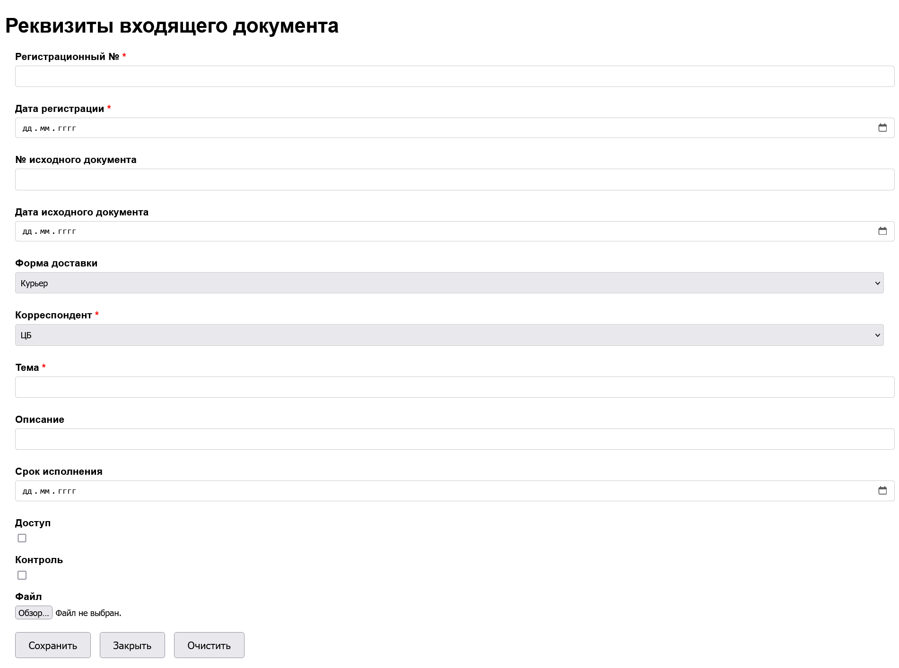

Post запрос: http://localhost:8080/api/documents/save
С следующим json:
```
{
    "regNumber": "12",
    "regDate": "2024-09-12",
    "outDocNumber": "98765",
    "outDocDate": "2024-09-09",
    "deliveryMethod": "Email",
    "correspondent": "ЦБ",
    "subject": "Важная тема документа.",
    "description": "Подробное описание документа.",
    "dueDate": "2024-09-15",
    "access": true,
    "control": false
}
```
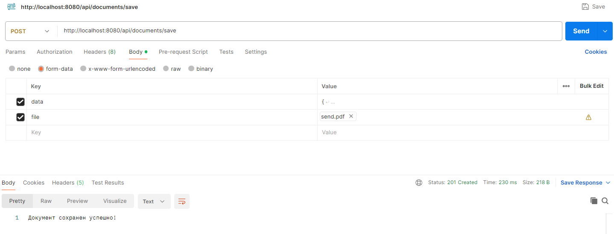

Get запрос определённого документа: http://localhost:8080/api/documents/1
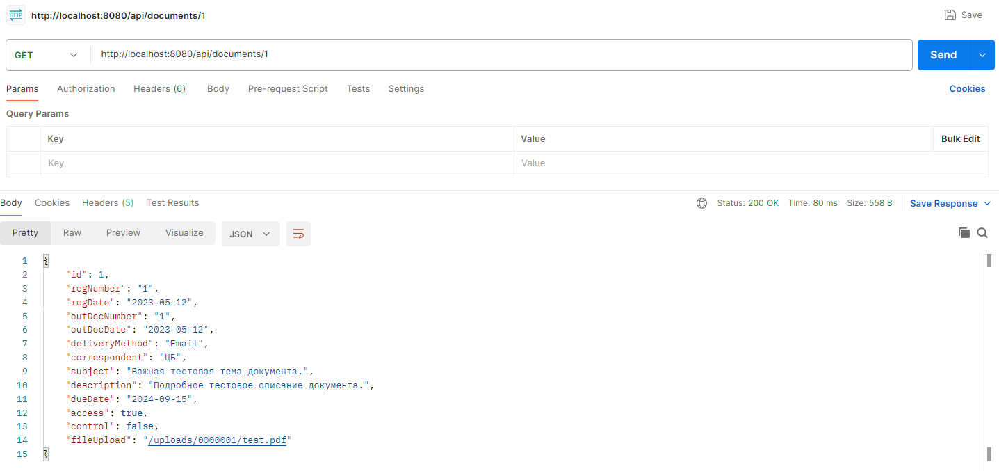

Get запрос всех документов: http://localhost:8080/api/documents/1
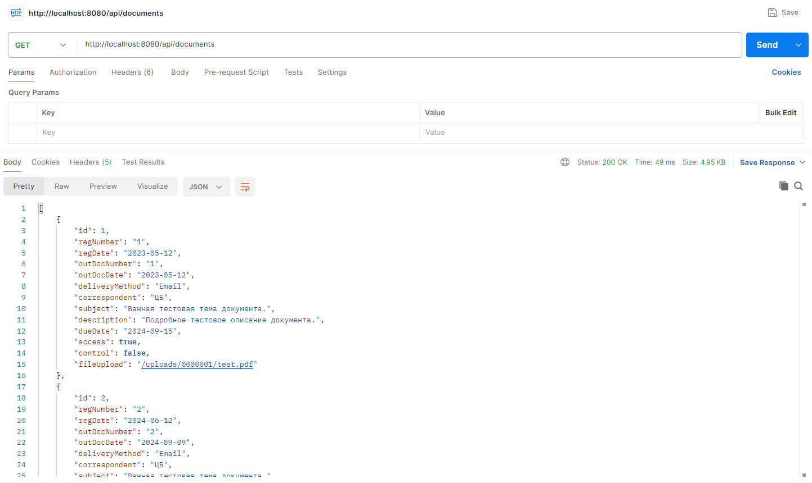

Get запрос всех документов: http://localhost:8080/api/documents/1


Put(обновление) запрос: http://localhost:8080/api/documents/12?data&file
С следующим json:
```
{
    "regNumber": "12",
    "regDate": "2024-09-12",
    "outDocNumber": "99999",
    "outDocDate": "2024-09-09",
    "deliveryMethod": "Email",
    "correspondent": "ЦБ",
    "subject": "Важная тема документа.",
    "description": "Подробное описание документа.",
    "dueDate": "2024-09-15",
    "access": true,
    "control": true
}
```
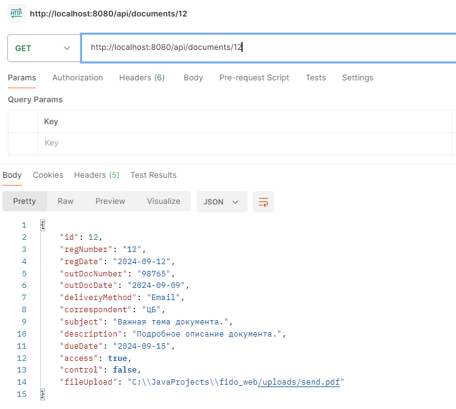
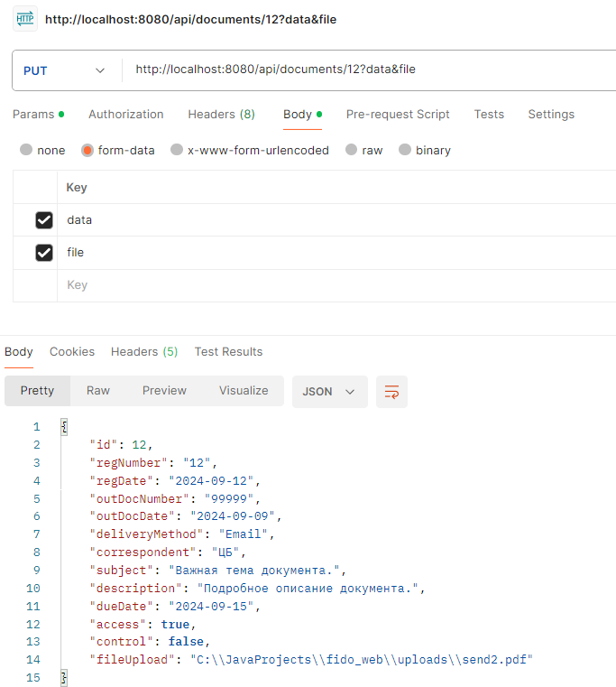

Delete запрос: http://localhost:8080/api/documents/12?data&file
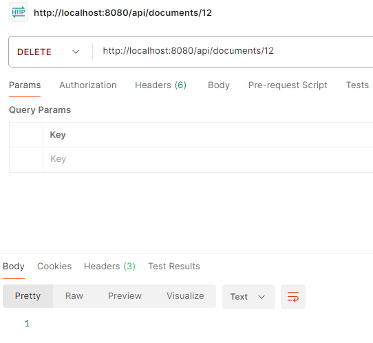

Delete запрос: http://localhost:8080/api/documents/12?data&file


## Тестовое задание №2

### 1) Предоставить количество писем по каждому корреспонденту по месяцам за текущий год.
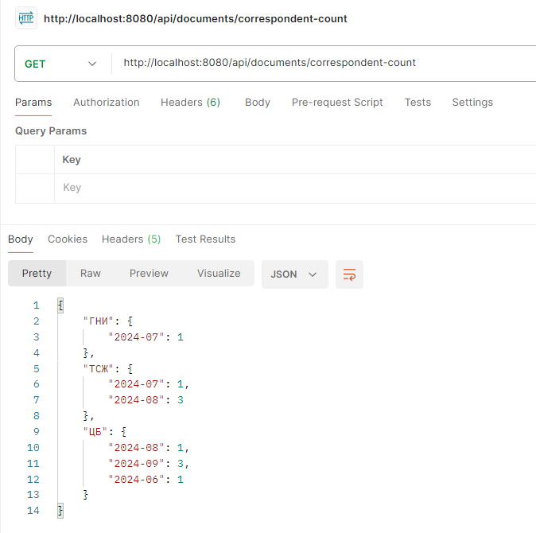

### 2) Предоставить список документов, поступивших от ЦБ (центрального банка) по электронной почте за текущий месяц.
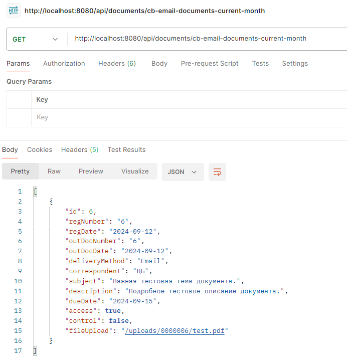

### 3) Предоставить список документов за 1 квартал текущего года, кроме поступивших из ГНИ с доставкой курьером.
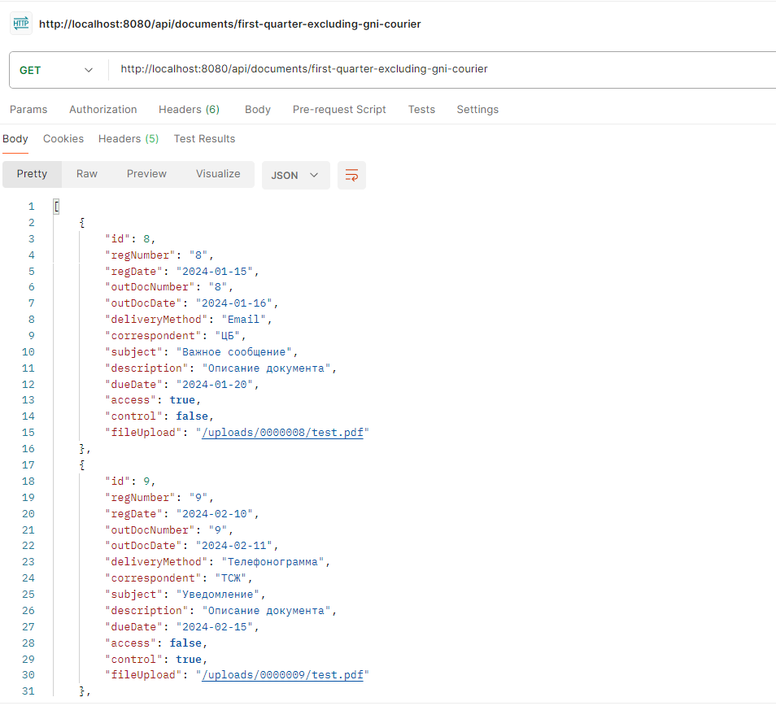

### 4) Предоставить список документов за предыдущий месяц, поступивших от ТСЖ, исключая документы о предоставления кредита (в теме писем от корреспондентов будет встречаться слово кредит).
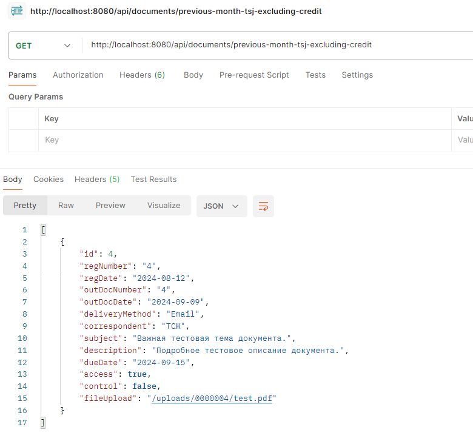
